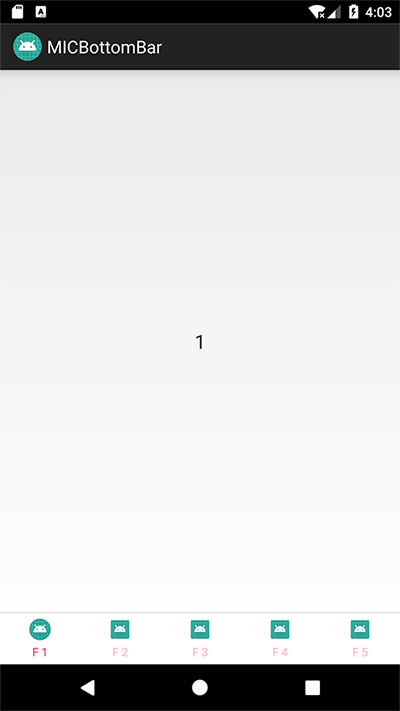

# MICBottomBar
传统国产 App 底栏

用 Kotlin 写的，功能简单，没什么技术含量，只是最近正在尝试 Kotlin 所以写着玩儿的



## 能干嘛
1. 定义图标大小 (如果图标不是正方形，则以宽为准进行等比缩放)
2. 定义选中图标和未选中图标
3. 定义字体大小
4. 定义字体选中颜色和未选中颜色
5. 定义底栏上下内边距
6. 底栏高度是自适应的，定义了也没用

## 属性
| 属性 | 描述 |
| ------------- | ------------- |
| bb_icon_size         | 图标大小 (默认 24dp) |
| bb_text_size         | 字体大小 (默认 12sp) |
| bb_select_text_color | 选中的字体颜色 (默认 #FF222222) |
| bb_text_color        | 未选中的字体颜色 (默认使用 #60选中的字体颜色) |
| bb_padding           | 底栏上下内边距 (默认 5dp) |
| bb_current_position  | 选中的 item 下标, 从 0 开始 (默认 0) |

## 使用
#### XML
```
<moe.yukinoneko.micbottombar.MICBottomBar
        android:id="@+id/bottomBar"
        android:layout_width="match_parent"
        android:layout_height="wrap_content"
        android:background="@android:color/white" />
```
#### Kotlin
```
bottomBar.addNavigationItems(
        MICBottomBar.NavigationItem(unSelectIconId, selectIconId, title),
        MICBottomBar.NavigationItem(unSelectIconId, selectIconId, title),
        MICBottomBar.NavigationItem(unSelectIconId, selectIconId, title)
)

bottomBar.setOnNavigationItemClickListener(object : MICBottomBar.OnNavigationItemClickListener {
    override fun onItemClick(view: View, position: Int) {

    }
})
```

## License
```
Copyright 2017 SamuelGjk. https://github.com/SamuelGjk

Licensed under the Apache License, Version 2.0 (the "License");
you may not use this file except in compliance with the License.
You may obtain a copy of the License at

http://www.apache.org/licenses/LICENSE-2.0

Unless required by applicable law or agreed to in writing, software
distributed under the License is distributed on an "AS IS" BASIS,
WITHOUT WARRANTIES OR CONDITIONS OF ANY KIND, either express or implied.
See the License for the specific language governing permissions and
limitations under the License.
```
